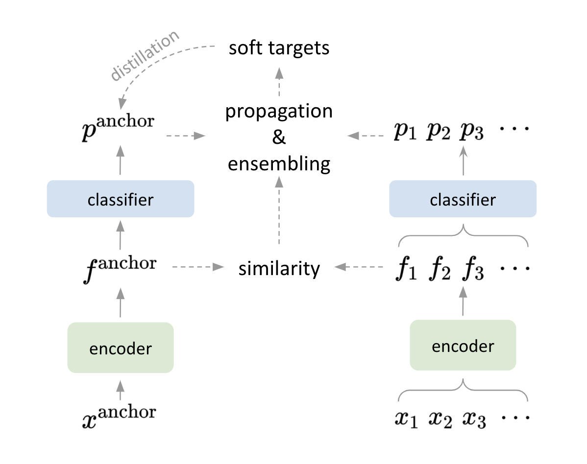

# Self-distillation with Batch Knowledge Ensembling Improves ImageNet Classification


<div align="center">
  
</div>


## Updates

[2021-06-08] The implementation of BAKE on small-scale datasets has been added, please refer to [small_scale](small_scale/).
[2021-06-09] The implementation of BAKE on ImageNet has been added, please refer to [imagenet](imagenet/).


## Citation

If you find **BAKE** helpful in your research, please consider citing:

```
@misc{ge2020bake,
    title={Self-distillation with Batch Knowledge Ensembling Improves ImageNet Classification},
    author={Yixiao Ge and Ching Lam Choi and Xiao Zhang and Peipei Zhao and Feng Zhu and Rui Zhao and Hongsheng Li},
    year={2021},
    archivePrefix={arXiv},
    primaryClass={cs.CV}
}
```
